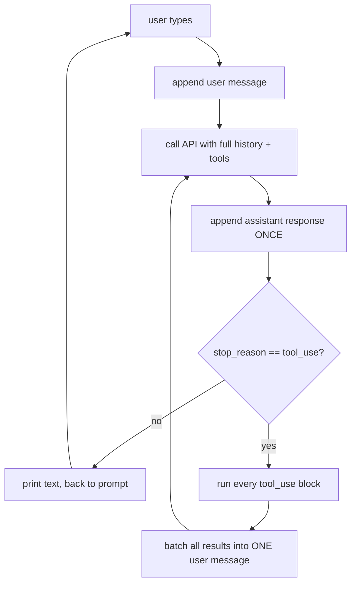

# Building a coding agent, step by step

Rebuilding the core of Claude Code by hand, one concept at a time. Each step adds
exactly **one** idea, and nothing new gets added until the idea before it works.

This file is the durable thread — it survives lost chat sessions. Update the status
column as you go.

**Legend:** ✅ done · 🔨 in progress · ⬜ not started

---

## Phase 1 — The loop that makes it an agent

The irreducible minimum. When this phase is done you have an agent, just a weak one.

| # | Concept | The insight it teaches | Status |
|---|---|---|---|
| 1 | Stateless API call | The LLM is a pure function: `f(messages) → message`. It remembers nothing between calls. | ✅ |
| 2 | Conversation history | "Memory" is just a Python list you resend in full every turn. The harness owns it. | ✅ |
| 3 | Tool schema + local dispatch | A tool is two separate things: a JSON schema the model reads, and a local function only the harness runs. The model can *ask*; it can never *do*. | ✅ |
| 4 | **The agent loop** | Feed the tool result back and call again — repeat until the model stops asking. This single loop is the whole difference between a chatbot and an agent. | ✅ |
| 5 | Correct message assembly | One assistant message per API response (roles must alternate); all tool results for a turn batched into one user message; `content` must be a string. | ✅ |
| 5b | Testing the loop | Swap in a fake client and the loop becomes pure logic you can assert exactly — no key, no cost, no model prose to regex against. Testing it *through* an LLM tests the LLM. | ✅ |
| 6 | System prompt | Where the agent's identity, rules and environment context live. Not a message — a separate parameter, resent on every call. Cheap to change, huge effect on behaviour. | 🔨 |

## Phase 2 — Becoming a *coding* agent

Tools are the agent's hands. This is where capability actually comes from.

| # | Concept | The insight it teaches | Status |
|---|---|---|---|
| 7 | `list_files` | The agent needs orientation before action. Without it, it guesses paths. | ⬜ |
| 8 | `edit_file` (exact string replace) | The highest-leverage tool there is. Also teaches why "old string must be unique" — it's how you make a blind edit safe. | ⬜ |
| 9 | `bash` | One tool that subsumes all others — and immediately creates the safety problem that motivates Phase 3. | ⬜ |
| 10 | Errors as feedback | A failed tool must return its error *to the model*, not crash the process. The model then self-corrects. This is the feedback loop. | ⬜ |

## Phase 3 — Making it safe and usable

| # | Concept | The insight it teaches | Status |
|---|---|---|---|
| 11 | Permission gating | The harness decides what's allowed — never the model. Approval happens between `tool_use` and running the function. | ⬜ |
| 12 | Streaming | Token-by-token output. Changes nothing about correctness, everything about how it feels. | ⬜ |
| 13 | Read-before-edit invariant | Harness-enforced state: refuse to edit a file the model hasn't read this session. Guardrails beat prompting. | ⬜ |

## Phase 4 — Scaling past one context window

| # | Concept | The insight it teaches | Status |
|---|---|---|---|
| 14 | Token accounting & compaction | Context is finite and every turn resends everything. Eventually you must summarise and drop. | ⬜ |
| 15 | Subagents | A subagent is context isolation: it burns its own window and returns only a conclusion. | ⬜ |
| 16 | Session persistence | Write the `messages` list to disk so a session can be resumed. (The thing that bit you today.) | ⬜ |

---

## Where the code stands right now

**Steps 1–5 are done**, verified at both layers:

- `make test` → 11/11
- `make selftest` → 5/5 against the real API, including `multihop`: the agent reads a
  file, finds it points at a second file, reads that one too, and answers — two tool
  round-trips inside one user turn. That's the loop genuinely looping.

`run_turn()` now owns the agent loop and `main()` is just the REPL around it. The
`is_last_call_tool` flag disappeared on its own, exactly as expected: once the loop
lives inside `run_turn`, there's nothing left to smuggle back out.

Next up is step 6 — see `tests/test_system_prompt.py`, currently red.

### What the loop should look like



The arrow from `H` back to `C` is the part that doesn't exist yet.

---

## Running it

```bash
direnv allow          # loads CLAUDE_KEY from .envrc
uv run main.py
```

## Ground rules for this project

- Concepts get built in order; no skipping ahead to the fun tools.
- The exercise code is written by hand, not generated. Claude scaffolds TODOs and
  explains, and reviews after — it doesn't fill them in.
