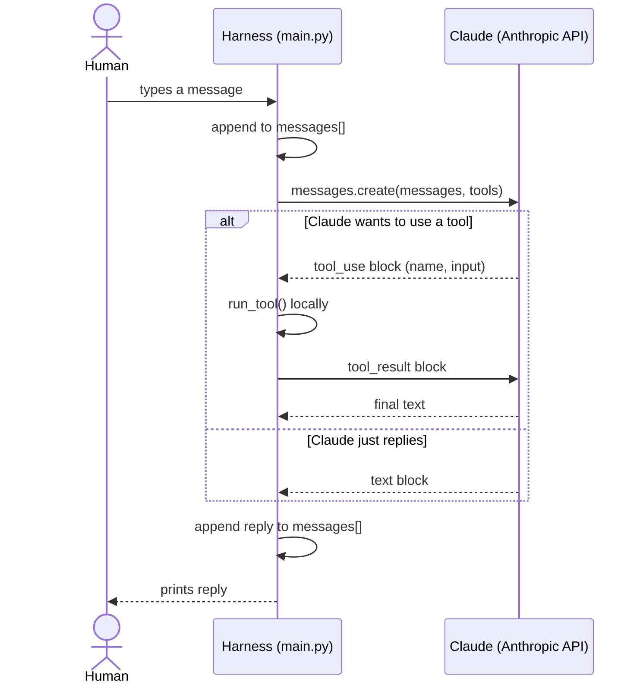

# agent-de

A minimal, hand-built version of a Claude-Code-like coding agent, built step by step to understand how these tools actually work under the hood.

## How it works

## What lives where

| Component | Lives in | Holds |
|---|---|---|
| **Human** | Terminal | Types input, reads output. No memory of its own — just eyes and a keyboard. |
| **Harness** (`main.py`) | Your machine, this Python process | The **conversation history** (`messages` list), the **tool implementations** (`read_file`, `run_tool`), the loop, the API key. This is the only place any state persists. |
| **LLM** (Claude) | Anthropic's servers | **Nothing.** Every API call is stateless — Claude has no memory between calls and only "knows" what's in the `messages` list you send that turn. It can *request* a tool call, but never executes anything itself; the harness always does. |

Key idea: the LLM is a pure function — `f(messages) -> next message`. All state (history, files, tool results) lives in the harness, not the model.
